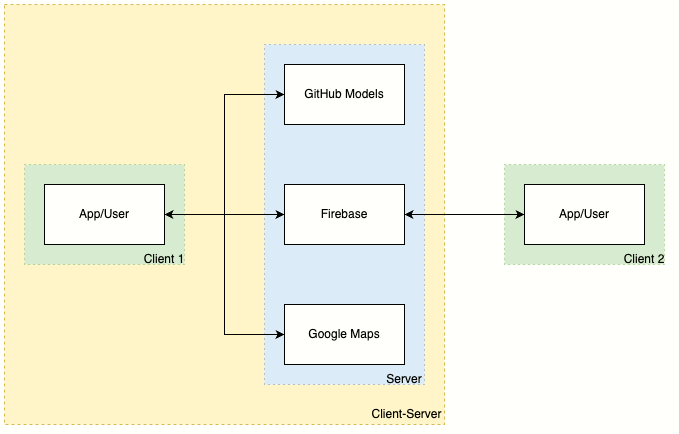
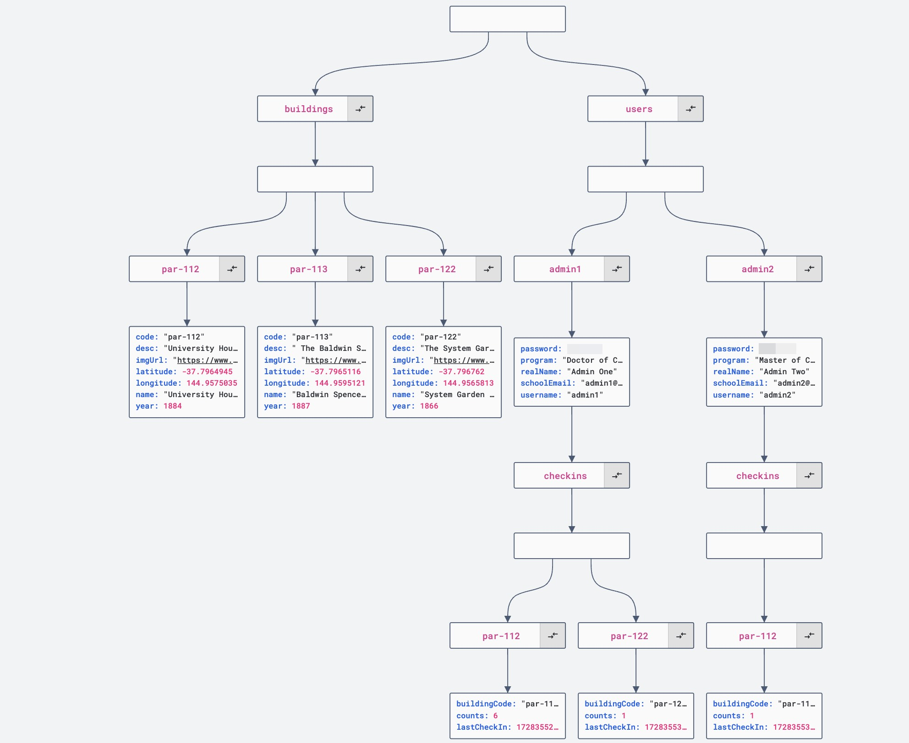

# AOMUS

_All-in-One for Melbourne University Students_ (_AOMUS_, /ˈau̇-mər-s/) is an Android app designed for new students of the University of Melbourne to get familiar with the campus. Users with this Android app can:

- have their own profiles in the app
- visit the University of Melbourne with predefined routes
- check in near/inside the places of interest on campus by scanning QR codes
- leave comments on the places of interest on campus
- read the introduction to a place of interest, provided by ChatGPT
- view and modify their course details (e.g., schedules, venues)

<!-- TOC start (generated with https://github.com/derlin/bitdowntoc) -->

## Table of Contents

- [AOMUS](#aomus)
  - [Table of Contents](#table-of-contents)
  - [Architecture](#architecture)
    - [Database Management System (DBMS)](#database-management-system-dbms)
  - [Quick Links](#quick-links)
  - [Requirements](#requirements)
  - [Development Conventions](#development-conventions)
    - [Committing](#committing)
    - [Branching](#branching)
  - [Resources](#resources)

<!-- TOC end -->

## Architecture

The AOMUS architecture follows a client-server model, where the Android app interacts with the Firebase backend services for data storage, retrieval, and user authentication. The key components of the architecture include:

- **client (Android app)**:
  - provides a user interface for interactions such as viewing profiles, checking in at locations, and reading building information
  - features for QR code scanning and so forth
  - communicates with Firebase for all real-time data needs (e.g., check-ins, profiles)
- **server**:
  - **Firebase**
    - stores data in a JSON format, ensuring real-time updates across all connected clients
    - manages user profiles, building details, check-in data, and so forth
    - synchronizes data changes automatically in real time, allowing users to instantly see updates
  - **GitHub Models**
    - provides large language models for user queries, enabling intelligent, AI-powered responses
  - **Google Maps**
    - offers basic map-based and location-based services



### Database Management System (DBMS)

The following schema outlines the structure of the Firebase Realtime Database, a JSON-based NoSQL DBMS used by AOMUS. Data are stored in collections, with each node representing a distinct type of entity:

```
root/
├── buildings/
│   └── {buildingCode}/
│       ├── code: `String`
│       ├── desc: `String`
│       ├── imgUrl: `String`
│       ├── latitude: `float`
│       ├── longitude: `float`
│       ├── name: `String`
│       └── year: `int`
└── users/
    └── {username}/
        ├── checkins/
        │   └── {buildingId}/
        │       ├── buildingCode: `String`
        │       ├── counts: `int`
        │       └── lastCheckIn: `long`
        ├── password: `String`
        ├── program: `String`
        ├── realName: `String`
        ├── schoolEmail: `String`
        └── username: `String`
```

- **`buildings`**: a collection of all buildings on the campus. Each `building` contains metadata like its name, location (latitude/longitude), description, and year of establishment.
- **`users`**: a collection of registered users. Each user has personal details such as username, email, and program information, with a `checkin` node to track the buildings they have visited.



## Quick Links

- 📅 [GitHub project](https://github.com/users/wille-wang/projects/12)
- 👨‍🎓 [Assignment specification](https://canvas.lms.unimelb.edu.au/courses/183251/assignments/494805)
- 👨‍💻 [Android developer guides](https://developer.android.com/guide)

## Requirements

- [Android Studio Koala/2024.1.1+](https://developer.android.com/studio/releases/past-releases/as-koala-release-notes)

## Development Conventions

### Committing

[](https://conventionalcommits.org)

This repository intends to use [Conventional Commits](https://www.conventionalcommits.org/en/), which was adapted from the [Angular Commit Style](https://github.com/angular/angular/blob/22b96b9/CONTRIBUTING.md#commit-message-format).

> [!IMPORTANT]
>
> Commits can only be submitted via [branching](#branching) and [pull requests (PRs)](https://docs.github.com/en/pull-requests/collaborating-with-pull-requests/getting-started/best-practices-for-pull-requests#best-practices-for-creating-pull-requests)!

### Branching

- **main branch** (`main`): stable deliverable
- **feature branch** (`feat-xxx`): implementation of one new feature
- **bugfix branch** (`fix-xxx`): bug fixes
- **documentation branch** (`docs-xxx`): documentation writing

> [!TIP]
> You can also use the type tags following the [commit convention](#committing).

## Resources

- [University of Melbourne: Image Gallery](https://www.unimelb.edu.au/filming-on-campus/gallery)
