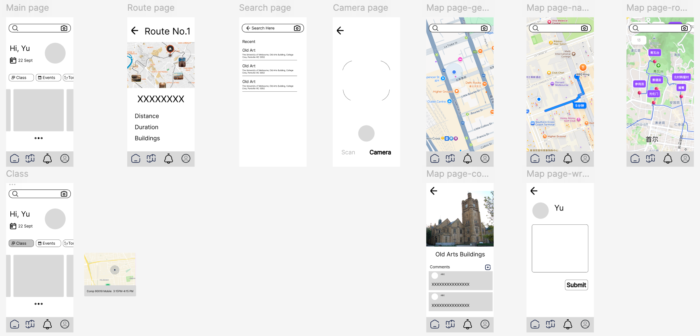

# Prototype

The prototype is illustrated on [Figma (permission required)](https://www.figma.com/design/EMvfmQb1jpwBSqKP85ldSt/Mobile?node-id=0-1&t=tAy5OaScLxPNCRVa-1).

## Functionalities

Users with this Android app can:

- have their own profiles in the app
- visit the University of Melbourne with predefined routes
- check in near/inside the places of interest on campus by scanning QR codes
- leave comments on the places of interest on campus
- read the introduction to a place of interest, provided by ChatGPT
- view and modify their course details (e.g., schedules, venues)
